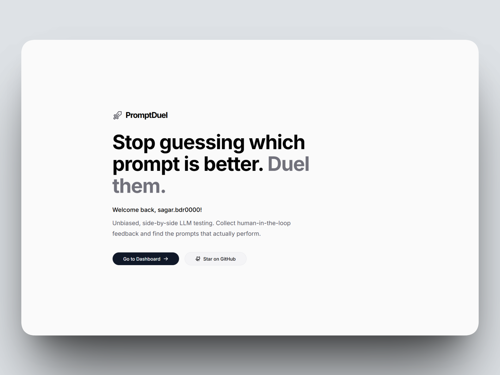

<a name="readme-top"></a>

[![Contributors][contributors-shield]][contributors-url]
[![Forks][forks-shield]][forks-url]
[![Stargazers][stars-shield]][stars-url]
[![Issues][issues-shield]][issues-url]
[![MIT License][license-shield]][license-url]
[![LinkedIn][linkedin-shield]][linkedin-url]

<br />
<div align="center">
  <a href="https://github.com/SAGAR-TAMANG/prompt-duel-main">
    
  </a>

  <h3 align="center">PromptDuel</h3>

  <p align="center">
    The Open Source A/B Testing Arena for LLMs.
    <br />
    <a href="https://promptduel.feynmanpi.com"><strong>View Live Demo »</strong></a>
    <br />
    <br />
    <a href="https://github.com/SAGAR-TAMANG/prompt-duel-main/issues">Report Bug</a>
    ·
    <a href="https://github.com/SAGAR-TAMANG/prompt-duel-main/issues">Request Feature</a>
  </p>
</div>

## Interface

<div align="center">
  
</div>

<details>
  <summary>Table of Contents</summary>
  <ol>
    <li>
      <a href="#about-the-project">About The Project</a>
      <ul>
        <li><a href="#built-with">Built With</a></li>
      </ul>
    </li>
    <li>
      <a href="#getting-started">Getting Started</a>
      <ul>
        <li><a href="#prerequisites">Prerequisites</a></li>
        <li><a href="#installation">Installation</a></li>
      </ul>
    </li>
    <li><a href="#features">Key Features</a></li>
    <li><a href="#roadmap">Roadmap</a></li>
    <li><a href="#contributing">Contributing</a></li>
    <li><a href="#license">License</a></li>
    <li><a href="#contact">Contact</a></li>
    <li><a href="#acknowledgments">Acknowledgments</a></li>
  </ol>
</details>

## About The Project

> **"Stop guessing which prompt is better. Duel them and let the data decide."**

When developing AI Agents, small semantic changes in a prompt can lead to drastically different outputs. Tracking this in spreadsheets is messy. You need a way to **blind test** these outputs against each other to get clean, unbiased data.

**PromptDuel** is a lightweight tool designed for AI Engineers and Prompt Designers. It solves the "vibe check" problem by providing a structured, data-driven environment to evaluate LLM outputs side-by-side.

<p align="right">(<a href="#readme-top">back to top</a>)</p>

### Built With

* [![Next][Next.js]][Next-url]
* [![React][React.js]][React-url]
* [![Tailwind][TailwindCSS]][Tailwind-url]
* [![Supabase][Supabase]][Supabase-url]
* **Shadcn/UI**
* **Recharts**
* **@dnd-kit**

<p align="right">(<a href="#readme-top">back to top</a>)</p>

## Getting Started

To run this code locally and start your own duel arena, follow these steps.

### Prerequisites

* Node.js (v18+)
* npm or pnpm

### Installation

1. **Clone the repo**
   ```sh
   git clone [https://github.com/SAGAR-TAMANG/prompt-duel-main.git](https://github.com/SAGAR-TAMANG/prompt-duel-main.git)

```

2. **Install dependencies**
```sh
npm install

```


3. **Environment Setup**
Create a `.env.local` file in the root directory and add your Supabase credentials:
```env
NEXT_PUBLIC_SUPABASE_URL=your_supabase_url
NEXT_PUBLIC_SUPABASE_ANON_KEY=your_supabase_anon_key

```


4. **Database Migration**
Run the SQL scripts provided in `supabase/migrations` (or the SQL editor) to set up the `duels` and `votes` tables.
5. **Run the development server**
```sh
npm run dev

```


<p align="right">(<a href="#readme-top">back to top</a>)</p>

## Features

* **⚖️ Side-by-Side Arena:** A clean, split-screen interface for comparing two text outputs (supports Markdown).
* **🫣 Blind Testing Mode:** Model names are hidden from voters to ensure unbiased feedback.
* **🔗 Instant Sharing:** Generate public, read-only links for clients or team members to cast votes.
* **📊 Analytics Dashboard:** Track vote velocity and win rates visually.
* **🔐 Secure:** Row Level Security (RLS) via Supabase ensures data integrity.

<p align="right">(<a href="#readme-top">back to top</a>)</p>

## Roadmap

* [x] Design & Develop the Arena UI
* [x] Implement Drag & Drop Duel Management
* [x] Integrate Recharts for Vote Velocity
* [x] Supabase Integration for Real-time Voting
* [ ] **Elo Rating System:** Calculate Elo scores for prompts across multiple duels.
* [ ] **API Integration:** Auto-fetch outputs from OpenAI/Anthropic directly.
* [ ] **Export Data:** Download vote results as CSV/JSON.

See the [open issues](https://github.com/SAGAR-TAMANG/prompt-duel-main/issues) for a full list...

<p align="right">(<a href="#readme-top">back to top</a>)</p>

## Contributing

Contributions are what make the open-source community such an amazing place to learn, inspire, and create. Any contributions you make are **greatly appreciated**.

1. Fork the Project
2. Create your Feature Branch (`git checkout -b feature/AmazingFeature`)
3. Commit your Changes (`git commit -m 'Add some AmazingFeature'`)
4. Push to the Branch (`git push origin feature/AmazingFeature`)
5. Open a Pull Request

<p align="right">(<a href="#readme-top">back to top</a>)</p>

## License

Distributed under the MIT License. See `LICENSE` for more information.

<p align="right">(<a href="#readme-top">back to top</a>)</p>

## Contact

Sagar Tamang - [LinkedIn](https://www.linkedin.com/in/sagar-tmg/)

Project Link: [https://github.com/SAGAR-TAMANG/prompt-duel-main](https://github.com/SAGAR-TAMANG/prompt-duel-main)

<p align="right">(<a href="#readme-top">back to top</a>)</p>

## Acknowledgments

* [Shadcn UI](https://ui.shadcn.com)
* [TanStack Query](https://tanstack.com/query/latest)
* [Lucide Icons](https://lucide.dev)

<p align="right">(<a href="#readme-top">back to top</a>)</p>

<!-- MARKDOWN LINKS & IMAGES -->
<!-- https://www.markdownguide.org/basic-syntax/#reference-style-links -->
[contributors-shield]: https://img.shields.io/github/contributors/SAGAR-TAMANG/prompt-duel-main?style=for-the-badge
[contributors-url]: https://github.com/SAGAR-TAMANG/prompt-duel-main/graphs/contributors
[forks-shield]: https://img.shields.io/github/forks/SAGAR-TAMANG/prompt-duel-main?style=for-the-badge
[forks-url]: https://github.com/SAGAR-TAMANG/prompt-duel-main/network/members
[stars-shield]: https://img.shields.io/github/stars/SAGAR-TAMANG/prompt-duel-main?style=for-the-badge
[stars-url]: https://github.com/SAGAR-TAMANG/prompt-duel-main/stargazers
[issues-shield]: https://img.shields.io/github/issues/SAGAR-TAMANG/prompt-duel-main?style=for-the-badge
[issues-url]: https://github.com/SAGAR-TAMANG/prompt-duel-main/issues
[license-url]: https://github.com/SAGAR-TAMANG/prompt-duel-main/blob/master/license.txt
[license-shield]: https://img.shields.io/github/license/SAGAR-TAMANG/prompt-duel-main?style=for-the-badge
[linkedin-shield]: https://img.shields.io/badge/-LinkedIn-black.svg?style=for-the-badge&logo=linkedin&colorB=555
[linkedin-url]: https://www.linkedin.com/in/sagar-tmg/
[Next.js]: https://img.shields.io/badge/next.js-000000?style=for-the-badge&logo=nextdotjs&logoColor=white
[Next-url]: https://nextjs.org/
[React.js]: https://img.shields.io/badge/React-20232A?style=for-the-badge&logo=react&logoColor=61DAFB
[React-url]: https://reactjs.org/
[TailwindCSS]: https://img.shields.io/badge/Tailwind_CSS-38B2AC?style=for-the-badge&logo=tailwind-css&logoColor=white
[Tailwind-url]: https://tailwindcss.com/
[Supabase]: https://img.shields.io/badge/Supabase-3ECF8E?style=for-the-badge&logo=supabase&logoColor=white
[Supabase-url]: https://supabase.com/
